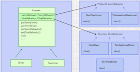

#  Design Patterns

What problem solve patterns
Patterns with proper use can save you a bunch of time on the support of your project.
Also, the patterns solve the problem of communication between programmers of one team, as knowing the patterns, you do not have to go into the details of your own version of solving the problem, because other team members will understand you with a half-word.

- [Strategy Pattern](https://github.com/dmitrysokoltsov/Patterns/tree/master/Strategy.playground "Strategy")

